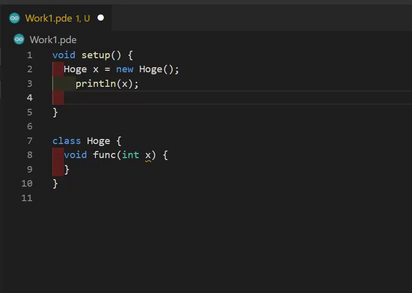

# Processing Language Server VSCode
Processing VSCode Extension.



This extension is currently under development. This is very unstable. If it crashes, Run `Processing: Restart Language Server` from the command palette. If that doesn't work, restart VSCode.

## Install
* Recommend: Disable other Processing extensions.
* https://marketplace.visualstudio.com/items?itemName=kgtkr.processing-language-server-vscode

## Support Processing Version
* 4.1 >=

## Configuration
### `processing-language-server.processingPath` (required)
* Processing installed path.
* Example:
    ```json
    {
        // linux
        "processing-language-server.processingPath": "/home/user/processing-4.0b2",
        // windows
        "processing-language-server.processingPath": "C:\\Users\\user\\processing-4.0b2",
        // macos
        "processing-language-server.processingPath": "/Applications/Processing.app"
    }
    ```
